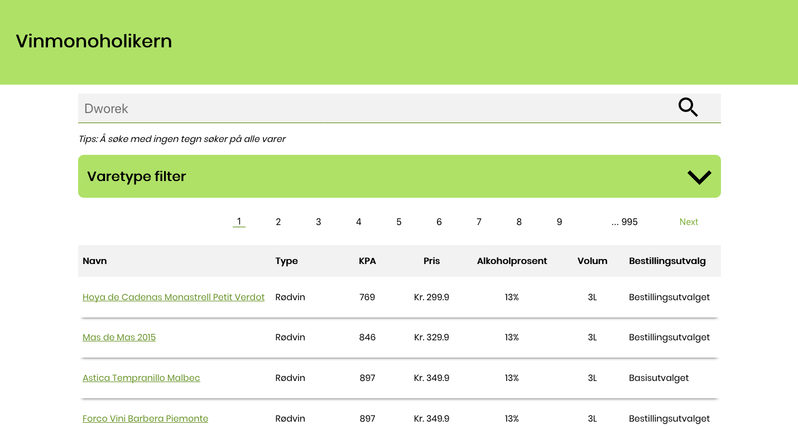
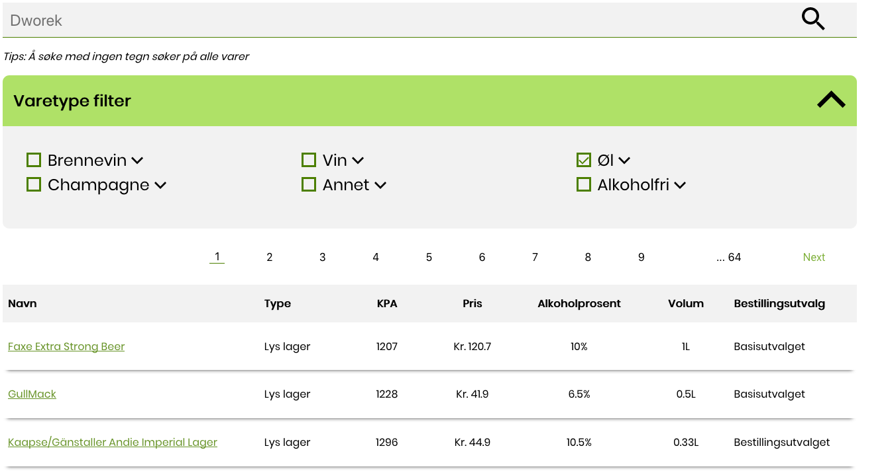
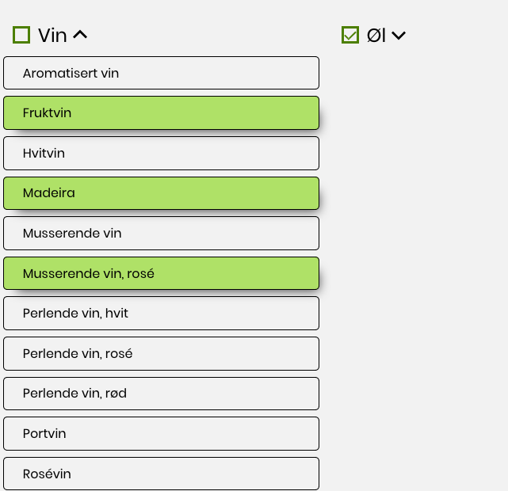

# Vinmonoholikern-2

This is the second installment of Vinmonoholikern.
To be honest, this is actually the third, but this is the second installment of the React implementation of Vinmonoholikern. The first one was dubbed AlcoSearch and was made with Django.

Vinmonoholikern-2 was rewritten from scratch due to in a year and a half's time I learned quite a lot with React. And going back to the original wasn't wanted, so I started a new project.

Vinmonoholikern-2 is live on [http://vinmonoholikern.com/](http://vinmonoholikern.com/)

This is an ongoing project, and will be working on it when I have some spare time.

Vinmonoholikern is written with Typescript + React and uses hooks to manage state, as well as all styling is done throuhg SASS.

The purpose of Vinmonoholikern is to find the cheapest alcohol one can buy based off of ABV and liter price, dubbed KPA. The less KPA, the better (it currently doesn't make much sense, but know that less KPA is good.)

The backend is a Node express backend which implements Facebook's GraphQl API. The decision to use GraphQl was to explore new technologies.
It was originally written in Kotlin, though it was a bit hard to get a Kotlin Spring Boot server up and going on Digital Ocean, I imported it to Node instead.

Incase the site is down, here are some images:

